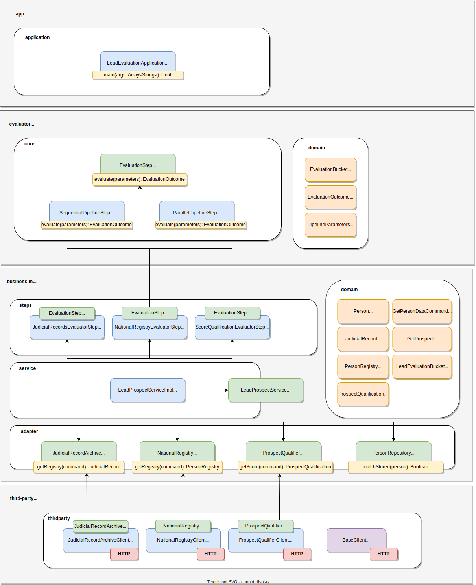

# Project Structure 

The following diagram represents an overview of the project structure.

<p align="center">
  
</p>

### Modules

| Modules | Description |
|:--------------|:------------|
| **app** | This module contains the entrypoint of the application. It's responsible to instantiate all dependencies and glue them together to execute the business logic. |
| **business** | This module contains the implementation of business logic. It performs the validations and aggregations over adapter interfaces. |
| **evaluator** | This module contains a common logic to handle a chain of responsability. It contains boilerplate to run a pipeline of steps. |
| **third-party** | This module contains the http client requests implementation. It's responsible for doing the tcp connection. |

# Running Instructions 

There are a few configurations that can be tweaked via enviornment variables to run this project. The following section describes them.

## Configuration

| environment variable | default | behavior  
|---|---|---|
| **EMBEDDED_MOCKSERVER_STUB** | true | If enabled this will run a stub http server that will replace all external system URL integration and response back with a successful response.
| **NATIONAL_REGISTRY_URL** | http://localhost:8080/national-registry | It changes the endpoint to perform national registry http requests.
| **JUDICIAL_ARCHIVE_URL** | http://localhost:8080/judicial-archive |  It changes the endpoint to perform judicial archive http requests.
| **PROSPECT_QUALIFIER_URL** | http://localhost:8080/prospect-qualifier |  It changes the endpoint to perform prospect score qualification http requests.


## Build and run via Command Line

### Running via command line

```bash
./gradlew clean fatJar
java -jar ./app/build/libs/app-1.0-SNAPSHOT-standalone.jar
```

## Build and run via Dockerfile 

### Running via docker
```bash
docker build . -t app 
docker run --interactive --tty --rm app
```

## Running Tests

### Running tests via command line

```bash
./gradlew test
```

### Running tests via docker

```bash
docker run --rm -v $(pwd):/home/gradle/src gradle:6.9.2-jdk11 gradle --no-deamon -p /home/gradle/src test
```
**Important:** Need to execute on project root folder so that the $(pwd) will pick the correct folder.
